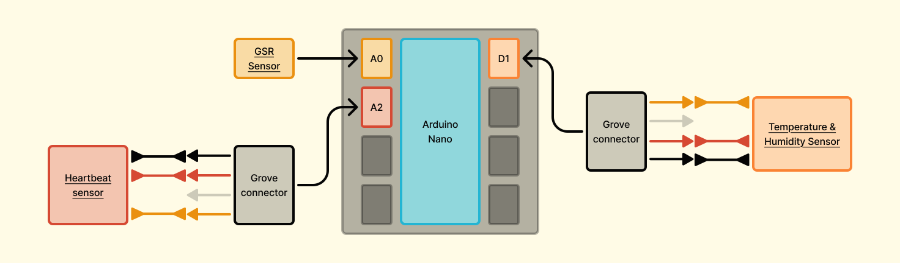

# The Emotional Void - Exploring the _space_ between emotions and words

An interactive solar system visualization that responds to real-time biometric data from Arduino sensors, creating a unique representation of affective states through generative art.

## Project Overview

This project creates a living, breathing solar system that changes based on your emotional and physical state. Using sensors to measure heart rate, galvanic skin response (GSR), temperature, and humidity, the visualization adapts its colors, opacity, and planetary movement to reflect your biometric data in real-time.

### The Concept

The visualization represents a poetic interpretation of human emotion through space:

- **Sun**: Pulses with your heartbeat, acting as the life force of the system
- **Planets**: Change colors based on temperature readings, representing emotional warmth
- **Orbital Speed**: Adjusts based on GSR levels, reflecting stress and arousal
- **Background Opacity**: Varies with humidity, creating atmospheric depth
- **Stars**: Provide a constant, meditative backdrop

## Architecture

The project consists of three main components:

### 1. Arduino Sensor Module (`emotional-sensors.ino`)

- **Heart Rate Sensor**: Detects heartbeat using photoplethysmography
- **DHT11 Sensor**: Measures temperature and humidity
- **GSR Sensor**: Measures galvanic skin response (emotional arousal/stress)
- **Data Format**: Sends JSON messages via serial communication

### 2. Node.js WebSocket Server (`src/server.ts`)

- **Serial Communication**: Reads data from Arduino via SerialPort
- **WebSocket Server**: Broadcasts sensor data to web clients
- **Real-time Relay**: Acts as a bridge between hardware and visualization

### 3. P5.js Visualization (`public/mySketch.js`)

- **Generative Art**: Creates an interactive solar system
- **Real-time Response**: Updates visuals based on incoming biometric data
- **Responsive Design**: Adapts to different screen sizes

## Technical Stack

- **Hardware**: Arduino (with DHT11, GSR, and heart rate sensors)
- **Backend**: Node.js, TypeScript, WebSocket, SerialPort
- **Frontend**: P5.js, HTML5 Canvas, WebSocket client
- **Build Tools**: TypeScript, Nodemon, Concurrently

## Hardware Setup

### Required Components

- Arduino (Uno/Nano recommended)
- DHT11 temperature/humidity sensor
- GSR (Galvanic Skin Response) sensor
- Heart rate sensor (photoplethysmography)
- Connecting wires and breadboard

### Wiring Diagram



- **DHT11**: Digital pin D2
- **GSR Sensor**: Analog pin A2
- **Heart Rate Sensor**: Analog pin A0
- **LED**: Built-in LED (pin 13) for heartbeat indication

## Installation & Setup

### Prerequisites

- Node.js (v14 or higher)
- Arduino IDE
- Yarn or npm

### 1. Clone the Repository

```bash
git clone https://github.com/your-username/emotional-space.git
```

### 2. Install Dependencies

```bash
yarn install
```

### 3. Upload Arduino Code

1. Open `emotional-sensors.ino` in Arduino IDE
2. Install required libraries:
   - DHT sensor library
   - ArduinoJson library
3. Connect your Arduino and upload the code
4. Note the COM port (e.g., COM5 on Windows)

### 4. Configure Serial Port

Edit `src/server.ts` and update the COM port:

```typescript
const arduinoPort = new SerialPort({
  path: "COM5", // Update this to your Arduino's port
  baudRate: 9600,
});
```

### 5. Run the Application

```bash
yarn dev
```

This command will:

- Start the WebSocket server on port 8080
- Launch the web visualization on http://localhost:3000
- Automatically open your default browser

## How It Works

### Data Flow

1. **Sensors** → Arduino reads biometric data every second
2. **Arduino** → Sends JSON data via serial to Node.js server
3. **Server** → Broadcasts data to connected WebSocket clients
4. **Visualization** → Updates visual elements in real-time

### Sensor Mappings

- **Temperature (30-40°C)** → Planet colors (cool blue to warm red)
- **Humidity (50-100%)** → Background opacity (clear to misty)
- **GSR (200-500)** → Orbital rotation speed (calm to energetic)
- **Heart Rate** → Sun pulsing rhythm

### Visual Elements

- **Sun**: Central star that pulses with heartbeat
- **Orbits**: Dashed circular paths that rotate based on GSR
- **Planets**: Colored spheres that orbit and change color with temperature
- **Stars**: Background stars for visual depth
- **Background**: Semi-transparent overlay that changes with humidity

## Customization

### Color Palette

Modify the `palette` array in `mySketch.js` to change the color scheme:

```javascript
const palette = [
  "#573280", // Deep purple
  "#70587C", // Mauve
  "#23B5D3", // Cyan
  // Add your colors...
];
```

### Sensor Ranges

Adjust the mapping ranges in the WebSocket message handler:

```javascript
// Temperature mapping (adjust min/max values)
const i = map(newTemperature, 30, 40, 0, 9);

// Humidity mapping
const n = map(newHumidity, 50, 100, 128, 50, true);

// GSR mapping
const v = map(newGSR, 200, 500, 0.005, 0.001, true);
```

## Troubleshooting

### Common Issues

1. **Arduino not connecting**

   - Check COM port in `src/server.ts`
   - Ensure Arduino drivers are installed
   - Verify baud rate (9600)

2. **No sensor data**

   - Check wiring connections
   - Verify sensor libraries are installed
   - Monitor Arduino Serial Monitor

3. **WebSocket connection failed**
   - Ensure server is running on port 8080
   - Check firewall settings
   - Verify WebSocket URL in browser console

### Debug Mode

Enable console logging in the browser to see incoming sensor data:

```javascript
// Already included in mySketch.js for easier debugging, feel free to remove it
console.log("Received data:", data);
```

## Development

### Scripts

- `yarn server` - Start only the WebSocket server
- `yarn open` - Start only the web server
- `yarn dev` - Start both servers concurrently

### File Structure

```
├── emotional-sensors.ino    # Arduino sensor code
├── package.json            # Node.js dependencies
├── tsconfig.json          # TypeScript configuration
├── src/
│   └── server.ts          # WebSocket server
└── public/
    ├── index.html         # Web app entry point
    ├── mySketch.js        # P5.js visualization
    └── style.css          # Minimal styling
```

## Contributing

1. Fork the repository
2. Create a feature branch (`git checkout -b feature/amazing-feature`)
3. Commit your changes (`git commit -m 'Add amazing feature'`)
4. Push to the branch (`git push origin feature/amazing-feature`)
5. Open a Pull Request
